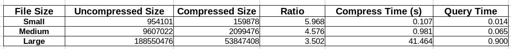

# ACS Dictionary Encoder
The purpose of a dictionary encoder is to reduce the size of a column of strings (or just data) with lots of repeated members into a more optimal size.  In essence, this project aims to emulate a form of LZ compression wherein repeated members of a column are replaced with a smaller pointer to the real member.  This project uses a per-file scheme that creates an optimal symbol alphabet using Huffman coding on the per-string level.

# Data Structure
This project does not use any home-made data structures. Instead it uses the C++ standard library's unordered map implementation very heavily.  Internally, this structure uses a hash table.  The "magic" of this project is in the way that it compresses strings.

# Installation / Runtime
NOTE: The large column file that was provided is not included because of its size here. The small and medium columns are available, however.

The program has two modes: these are `encode` and `query`.

### Build
To build the project:
`g++ main.cpp -o a.out -g -fpermissive`

### Encode
The encoding operation takes a column file and first parses it for duplicates. While doing so, it keeps track of the frequency of each unique string.  Using this information, a greedy algorithm is used to construct the optimal Huffman encoding tree.  Then a map is produced which allows you to directly translate a string into its encoded counterpart.

To encode a column file:
`./a.out encode <column-file> <output-file>`

### Query
Query allows you to check the frequency of a given string in the dictionary.  It loads metadata from the encoded column file and uses it to query the encoded dictionary about its members.

To query a column file for a string:
`./a.out query <bitstream-file> <your-string>`

# Experimental Results

